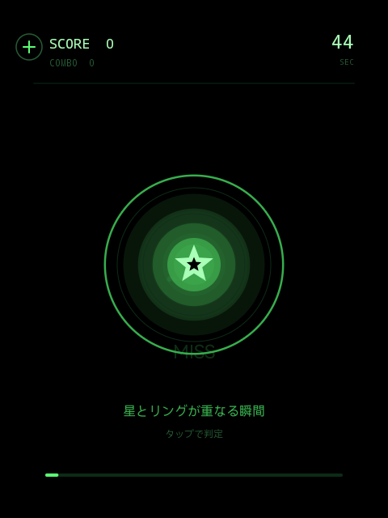
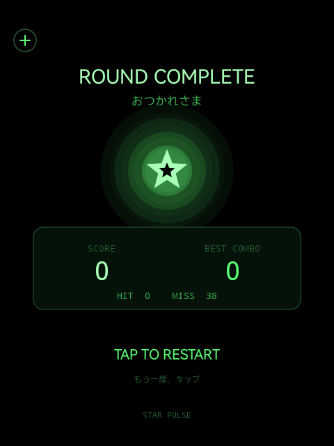

# STAR PULSE

**星とリングが重なる瞬間に、タップ。Rokid Glasses向けの45秒タイミングゲームです。**

縮んでいくリングを見ながら、中央の星に重なる瞬間を狙います。タイミングが合うと光の粒が広がり、連続成功に合わせて効果音の高さと得点が変わります。

<p>
  
  
</p>

画像は2026年9月6日の開発時に保存された実機画面です。検証中の画面であり、参加者のプレイ実績やグラス越しの見え方を示すものではありません。今回の公開版を動かして取得した画像ではありません。

## 遊び方

1. グラス側面をタップして開始します。
2. リングが中央の星に重なる瞬間に、もう一度タップします。
3. `GOOD`・`PERFECT`をつなぎ、45秒間で得点を伸ばします。
4. 結果画面からタップで再挑戦できます。

| 判定 | 得点・コンボ |
| --- | --- |
| PERFECT | 25点＋連続数×2点のボーナス。ボーナスは最大30点 |
| GOOD | 10点＋連続数のボーナス。ボーナスは最大20点 |
| MISS | 減点なし。コンボをリセット |

連続数は今回の成功を含めて計算します。最初のGOODは11点、PERFECTは27点です。早すぎるタップや、リングが縮み切るまでの見送りはMISSになります。

結果画面の`BEST COMBO`は、そのラウンド内の最大コンボです。得点や記録を端末に保存する機能はありません。

頭の動きやスマートフォンの操作は使いません。ネット接続、アカウント登録、カメラ・マイクの権限は不要です。

## 制作と公開

2026年9月6日、XR Meetup KagoshimaとSmart Glasses Creative Labが共催した[Smart Glasses Vibeathon Kagoshima 2026｜XR Meetup Kagoshima 3周年記念イベント](https://luma.com/zudko7vk)で制作したゲームアプリです。

会場でCodex GPT-6 Astraに10分でのゲームの開発・制作を依頼し、最初の指示だけで形になった、いわゆる「ポン出し」の制作例です。人から追加の修正指示を挟まず、Astraが全体ディレクション、Luna MAXのサブエージェントが実装を担当しました。

「タップだけで操作できること」「効果音を入れること」を伝え、具体的なゲームのアイデアと実装をAIに任せた[最初の指示文を原文のまま公開しています](docs/INITIAL_PROMPT.md)。

「10分」は最初の指示に含めた制作時間の条件です。

公開準備では、ゲームのJava・Androidリソースを保持し、ビルド環境の指定、利用手順、検証記録を整えました。アプリ本体の変更は改行・末尾空白の整理だけです。

## 対象端末と確認範囲

- 過去の確認端末：Rokid RG_glasses、Android API 32、480×640。
- 開発記録には、APKの導入・起動、画面表示、GOOD判定での加点、ラウンド終了の記録があります。
- 今回の公開用コピーはPC上でビルドと署名検証を実施しました。今回の実機再テストは未実施です。
- 物理的な側面タップの操作感と、スピーカーで各効果音を聴取できるかは未確認です。
- 他のRokid製品・ファームウェアでの動作は未確認です。
- アプリが背面に回った時間はラウンド進行から除外します。プロセス終了後に途中の状態は復元しません。

詳細と確認項目は[検証状況](docs/VERIFICATION.md)に記載しています。

## ビルドする

Windows向けのPowerShellスクリプトでAPKを作ります。GradleやRokid SDKは使いません。

必要なもの：

- PowerShell 7
- JDK（Android Studio付属のJBR、または`JAVA_HOME`で指定）
- Android SDK Platform 36、Build Tools 36.0.0
- 実機への導入にはAndroid SDK Platform-Tools（ADB）

SDKの場所は`ANDROID_HOME`、`ANDROID_SDK_ROOT`の順に参照します。未指定の場合は`%LOCALAPPDATA%\Android\Sdk`を使います。JDKは`JAVA_HOME`、未指定の場合は`%ProgramFiles%\Android\Android Studio\jbr`を使います。

```powershell
pwsh -NoProfile -File .\build.ps1
```

成功すると`artifacts/starpulse-debug.apk`が生成されます。開発用署名鍵はローカルに新規生成します。APK・署名鍵・ビルド中間物はGitで管理せず、公開リポジトリに含めていません。

## 実機へ入れる

USBデバッグを有効にした端末を接続し、`YOUR_DEVICE_SERIAL`を`adb devices -l`に表示される端末IDに置き換えてください。以下は`adb`をPATHに追加した環境での例です。

```powershell
adb devices -l
adb -s YOUR_DEVICE_SERIAL install -r .\artifacts\starpulse-debug.apk
adb -s YOUR_DEVICE_SERIAL shell am start -n com.smartglasses.starpulse/.MainActivity
```

別の署名鍵で作った同じアプリが入っている場合は上書きできません。スクリプトでは既存アプリの自動削除や自動インストールを行いません。

## 実装

JavaのActivityと独自Viewでゲームを実装し、Canvasで星・リング・スコア・光の粒を描画します。開始・GOOD・PERFECT・MISS・終了の5種類の効果音は、PCM合成とAudioTrackで生成します。BGMはありません。外部の画像・音声素材や、実行時の生成AI APIは使いません。

入力はENTER・方向キー中央・スペース・ゲームパッドAのキーを離した時と、画面タッチを離した時に判定します。戻る操作はActivity／システムに渡します。

```text
app/src/main/      ゲーム・Androidリソース
scripts/          SDKとJDKの検出
docs/             検証記録・開発時の画面画像
build.ps1         APKのビルド・署名・メタデータ確認
```

自動テストは同梱していません。装着時の入力の反応、音、表示、中断・復帰は実機で確認してください。

## 作者・関連作品

企画・制作指示・実機確認：鮫🦈さめでぃれくたー / [aym-same](https://github.com/aym-same)

[プロフィール・活動リンク](https://aym-same.github.io/aymsmsm_link/) / [X](https://x.com/aym_same)

同じRokid Glasses向けの短いゲーム：[FERRY 20](https://github.com/aym-same/ferry20) / [たこ焼き仕分け！](https://github.com/aym-same/takoyaki-pon)

## 利用条件

[MIT License](LICENSE)で公開しています。利用・改変・再配布の際は、著作権表示とライセンス表示を残してください。
